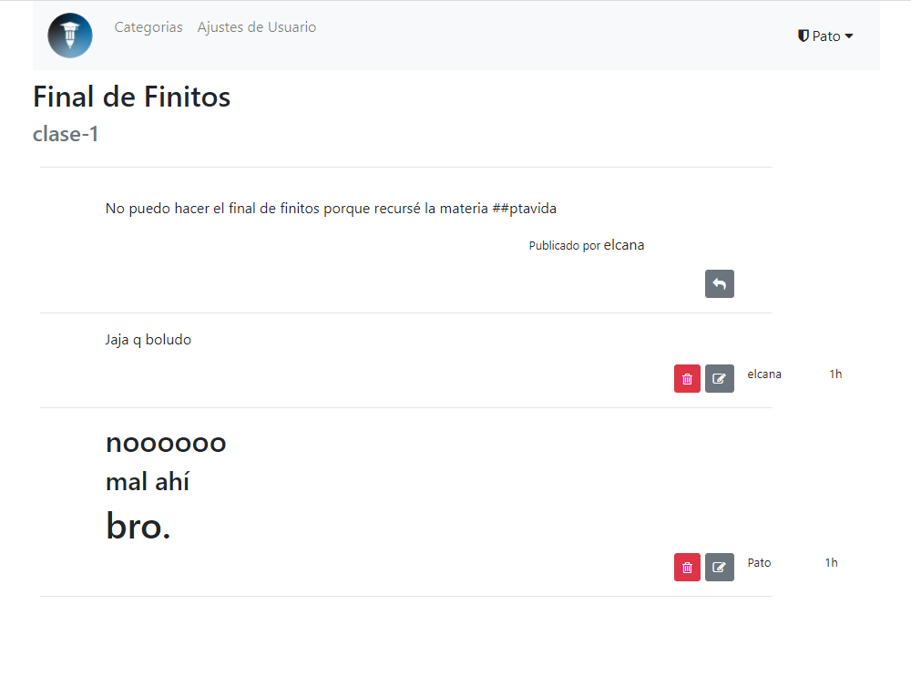

# curso: a saloon homage
A place to chat and communicate. Basically, a forum.
---
This is a [Buffalo](https://gobuffalo.io/) application based heavily on the excellent
but now derelict [go-saloon/saloon](https://github.com/go-saloon/saloon).

It uses Postgres SQL database and OAuth2 using goth.

Thanks to Sebastian Binet and the go-saloon authors for providing a sturdy foundation for this forum app.

## Looks

### Homepage

### Categories

### Topics

### Replies on topic


## How to run application
1. First step is to install `go` from [golang.org](https://golang.org).

2. Install buffalo from [buffalo.io](https://gobuffalo.io).

3. Install front-end package managers and build tools. If you are
running a linux machine you'll only need `yarnpkg`. If you are running
windows things might get hairy (see windows front end intallation at
the end of this document)
	```bash
	sudo apt install yarnpkg
	```

4.  Clone this repo on your machine
	```bash
	git clone https://github.com/soypat/curso 
	```

5. Run the following command in `~/curso` directory. This will install `buffalo-pop` which is the defacto database manager plugin for buffalo. This will enable you to run `buffalo pop <cmd>` commands
	```
		buffalo plugins install
	```

6. Create your database according to [`database.yml`](./database.yml) config file. The following section explains how to do that, for now I'll assume you have a SQL database up and running according to `database.yml`.

7. Run `buffalo dev` in the project directory. Wait a couple seconds for the following lines to show up

	```log
	INFO[2020-09-12T16:48:58-03:00] Starting application at http://127.0.0.1:3000
	INFO[2020-09-12T16:48:58-03:00] Starting Simple Background Worker
	```

8. Enjoy your forum at [127.0.0.1:3000](http://127.0.0.1:3000/)

Buffalo ships with the `dev` command that will watch your application and automatically rebuild the Go binary and any assets for you. That's useful when developing.


### Database setup

One needs a database to run `curso`.
Here is an example, running postgres inside a docker container:

```
$> docker run --name curso-postgres -e POSTGRES_PASSWORD=1337 -p 5432:5432 -d postgres
```

or optionally you can straight up create the curso db to not have to let 
buffalo create it on it's own: 

```bash
docker run --name forum-postgres  \
-e POSTGRES_PASSWORD=1337 \
-e POSTGRES_USER=pato \
-e POSTGRES_DB=curso \
-p 5432:5432 -d postgres
```

with this you are ready to run `buffalo pop migrate` and start up your application!

### Create your databases the hard way
If you did not create a database with `POSTGRES_DB` and `POSTGRES_USER` environment variables set then you must create the database beforehand. Remember the default docker `POSTGRES_USER` and `POSTGRES_DB` is `postgres` (for both) so you should change your `database.yml` file to match that. 

Ok, so you've edited the `database.yml` file and started postgres, now Buffalo can create the databases in that file for you:

```
$> buffalo pop create -a
```

You can run `buffalo pop migrate` to initialize the forum and the content of its database:

### Windows Front-end packages
1. Install scoop! minimalistic package manager
2. `scoop install nodejs`
3. `scoop install yarn`
4. `npm` gotta have python and c++ build tools for `node-sass`, don't ask me why, windows sucks. Run following in powershell in admin mode
```
npm install -g node-gyp
npm install --global --production windows-build-tools
```


## how i did this
Don't bother reading this. These are notes for myself if I ever try building a new buffalo app in the future.

`buffalo new curso` then `cd curso`


`buffalo pop g model user name nick provider provider_id email role subscriptions`
-> modify `models/user.go` -> change subscriptions to `slices.UUID` type. change
all types that are not fit for default datatype.

migration for `users`
```
create_table("users") {
    t.Column("id", "uuid", {primary: true})
    t.Column("name", "string", {})
    t.Column("nick", "string", {})
    t.Column("provider", "string", {})
    t.Column("provider_id", "string", {})
    t.Column("email", "string", {})
    t.Column("role", "string", {})
    t.Column("subscriptions", "varchar[]", {"null": true})
    t.Timestamps()
}
add_index("users", ["provider", "provider_id", "role"], {"unique":true})
```
`buffalo pop migrate`

Same goes for other db tables. `buffalo pop g model forum title description logo defcon staff`. db type for `[]byte` is `blob`


